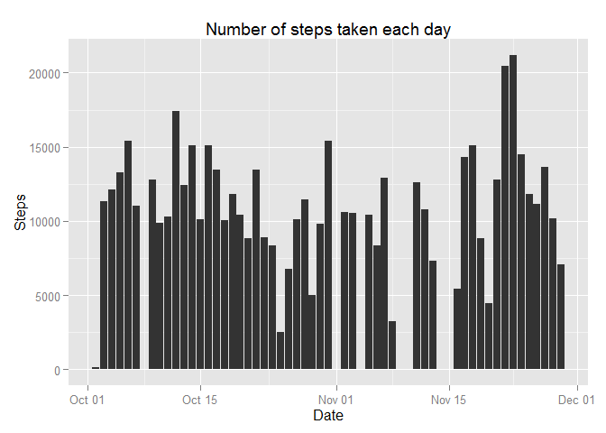
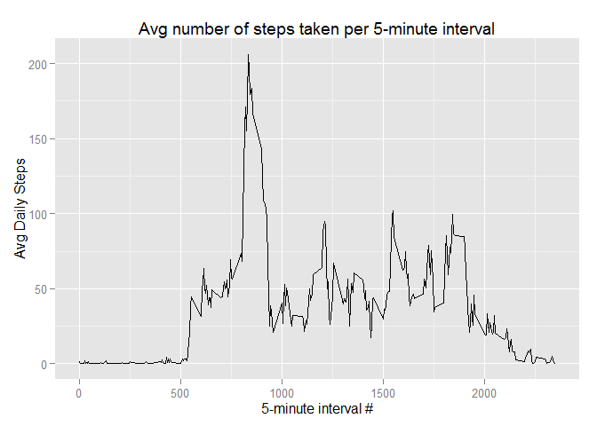
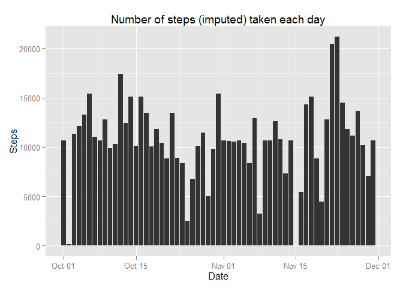
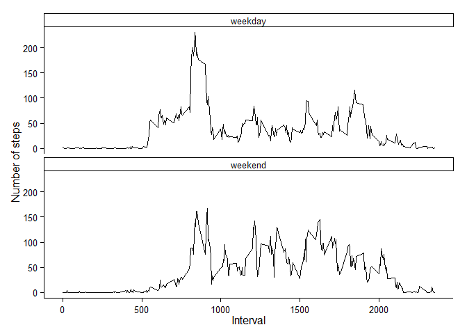

# Reproducible Research: Peer Assessment 1


## Loading and preprocessing the data

Original raw data is in compressed archive form. A CSV file ( comma separated values)
file is extracted from the archive. Then data is then loaded into an R data frame.
The colClasses argument is used to override read.csv() because a Date data type will
be more helpful downstream.  The "date" columns data type to Date rather than factor.


```r
unzip("activity.zip",overwrite=T)
df <- read.csv("activity.csv",colClasses=c("integer","Date","integer"))
```


## What is mean total number of steps taken per day?

Observations which are complete, i.e. have no missing values, are kept.
Then, steps are aggregated to the day level using the ddply function from the plyr 
package. The aggregated values are displayed in ggplot2 histogram.


```r
library(ggplot2)
library(plyr)

complete_cases_df <- df[complete.cases(df),]
daily_steps_df <- ddply(complete_cases_df,.(date),summarize,steps=sum(steps))

ggplot(data=daily_steps_df
       ,aes(x=date,y=steps))+
    xlab("Date")+
    ylab("Steps")+    
    geom_bar(stat="identity")+
    ggtitle("Number of steps taken each day")
```

 

**Mean number of daily steps**

```r
mean(daily_steps_df$steps)
```

```
## [1] 10766
```

**Median number of daily steps**

```r
median(daily_steps_df$steps)
```

```
## [1] 10765
```


## What is the average daily activity pattern?

```r
interval_df <- ddply(complete_cases_df,.(interval),summarize,mean_steps=round(mean(steps),2))

ggplot(data=interval_df
       ,aes(x=interval,y=mean_steps))+
    xlab("5-minute interval #")+
    ylab("Avg Daily Steps")+    
    geom_line() +
    ggtitle("Avg number of steps taken per 5-minute interval")
```

 

**Which 5-minute interval, on average across all the days in the dataset, contains the maximum number of steps?**

```r
interval_df[which.max(interval_df$mean_steps),c("interval","mean_steps")]
```

```
##     interval mean_steps
## 104      835      206.2
```

## Imputing missing values

** Calculate total number of rows with `NAs` **


```r
nrow(df[!complete.cases(df),])
```

```
## [1] 2304
```

There are a number of cases in which the number of steps is NA.  This may introduce
some bias in the data. We'll impute the missing steps using the average steps
for that 5 minute interval.  First, we'll round the mean number of steps per interval to 
a whole number because it seems more trouble than its worth to switch the analysis
to decimal numbers. Next, the original data set is merged with the average steps
per interval. Lastly, missing values are replaced with the average for the matching interval.


```r
interval_df$mean_steps = as.integer(interval_df$mean_steps)
merged_df <- merge(df,interval_df, by = c("interval"))
merged_df$steps <- with(merged_df,ifelse(is.na(steps),mean_steps,steps))
merged_daily_steps_df <- ddply(merged_df,.(date),summarize,steps=sum(steps))

ggplot(data=merged_daily_steps_df
       ,aes(x=date,y=steps))+
    xlab("Date")+
    ylab("Steps")+    
    geom_bar(stat="identity")+
    ggtitle("Number of steps (imputed) taken each day")
```

 

**Mean number of daily steps (imputed)**

```r
mean(merged_daily_steps_df$steps)
```

```
## [1] 10750
```

**Median number of daily steps (imputed)**

```r
median(merged_daily_steps_df$steps)
```

```
## [1] 10641
```


## Are there differences in activity patterns between weekdays and weekends?

A factor variable called day_type, with values of "weekday" and "weekend", is added 
to the imputed data set. Aggregation at the interval and day_type level then 
occurs. Lastly, the daily activity patterns, with a panel each for weekend and weekday.

* One difference is that more steps occur on weekends than weekdays. 
* Another difference? The weekday steps ramp up earlier in the day.  
* A third difference is that weekend steps tend to be more evenly distributed throughout the day.


```r
merged_df$day_type <- factor(ifelse(weekdays(merged_df$date) %in% c("Saturday","Sunday"),"weekend","weekday"))
merged_interval_df <- ddply(merged_df,.(interval,day_type),summarize,mean_steps=round(mean(steps),2))

ggplot(data=merged_interval_df
       ,aes(x=interval,y=mean_steps))+
    xlab("Interval")+
    ylab("Number of steps")+
    theme_classic()+
    geom_line() +
    facet_wrap(~day_type,ncol=1)
```

 
